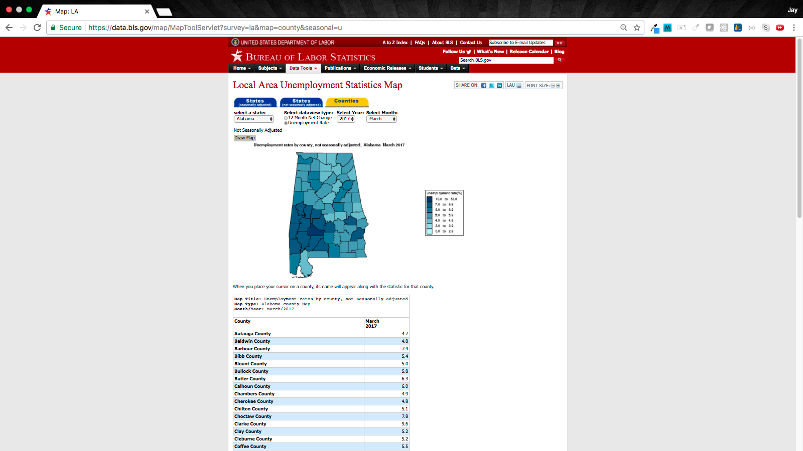

# US Unemployment Rates from 1990 - 2016

TL;DR:

```bash
$ python retrieve.py # or nohup python retrieve.py &
$ python transform.py
```

`retrieve.py` creates a folder `data/`, in which a folder `pages/` is created to store the raw HTML pages for every year / month / state / county combination (35,100 total HTML pages, ~ 3.75 GB). It also creates a `reference.json` file to map all codes for each of the four levels of granularity to their full text (i.e. `01` maps to `Alabama` or `M12` maps to `December`, etc).

`transform.py` iterates through files in `data/pages/` and creates `result.json` at the root of the project.

For the full dataset on Kaggle, visit: https://www.kaggle.com/jayrav13/unemployment-by-county-us

## Intro

The US Department of Labor's Bureau of Labor Statistics keeps track of Unemployment Rates at a county level over time, split into the following level of detail:

- Year
- Month
- State
- County

Here's a view of the [website](https://data.bls.gov/map/MapToolServlet?survey=la&map=county&seasonal=u):



The levels of detail that this dataset provides can be explored via the dropdown menus at the top of the page.

## Scraping

In order to retrieve data, this repository makes HTTP requests to retrieve data and Python's `lxml` library to scrape HTML data. Each request is built using the following function to make a query (found in the `retrieve.py` file):

```python
def data(state=None, datatype=None, year=None, period=None):
    """
    Given information on location and time period, returns dictionary to be used w/HTTP request.
    """
    return {
        'state': state,
        'datatype': datatype,
        'year': year,
        'period': period,
        'survey': 'la',
        'map': 'county',
        'seasonal': 'u'
    }
```

Here, a few elements are hardcoded in the request:

- `survey`: `la` means `Local Area`, indicating that this data is broken down to the County level.
- `map`: `county` refers to the map breakdown (this is not used for the dataset, but is required for the request)
- `seasonal`: `u` refers to `Not Seasonally Adjusted` or `(u)nadjusted`.

These HTML files are retrieved and stored in full. Following this, the `transform.py` file is employed to scrape specific data and store it as a JSON file.

The key elements of the `transform.py` file that extracts this data from the HTML pages are:

```python
# Get unemployment statistics.
counties = [x.text_content() for x in tree.xpath('//th[@class="OutputHead"]')]
counties = counties[2:len(counties)]
rates = [float(x.text_content()) for x in tree.xpath('//td[@class="OutputCell"]')]
```

## CSV

To get this data into CSV format, a simple script in `csv/transform.py` to generate `csv/output.csv`.

## Try It Yourself!

The top of this README confirms how to generate this data yourself - by running the `retrieve.py` and `transform.py` back to back. You can further run `csv/transform.py` to generate a CSV file from the originally generated `result.json` file.

By Jay Ravaliya